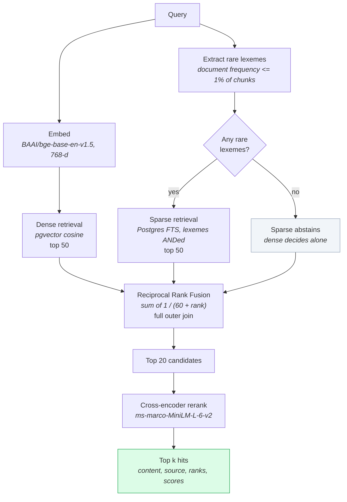
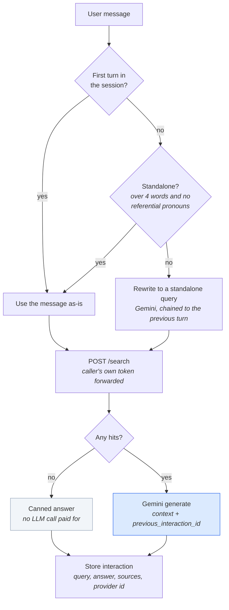
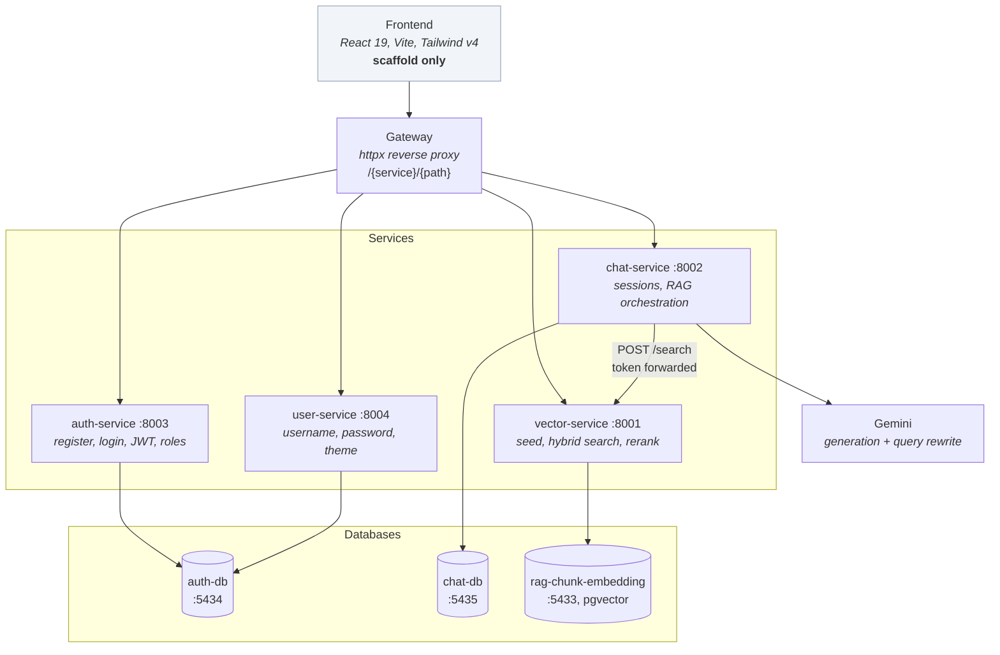

# Growpedia

A retrieval-augmented chat assistant for the [Growtopia wiki](https://growtopiawiki.com). It crawls the wiki into a local corpus, chunks and embeds it, and answers questions over that corpus using hybrid retrieval (dense vectors plus Postgres full-text search), a cross-encoder reranker, and Gemini for generation.

The backend is split into four FastAPI microservices behind a gateway, each with its own Postgres database.

---

## Table of contents

- [How retrieval works](#how-retrieval-works)
- [How conversation works](#how-conversation-works)
- [System architecture](#system-architecture)
- [The data pipeline](#the-data-pipeline)
- [Repository layout](#repository-layout)
- [Getting started](#getting-started)
- [API reference](#api-reference)
- [Tuning constants](#tuning-constants)
- [Project status](#project-status)
- [Known limitations](#known-limitations)

---

## How retrieval works

A single dense retriever is not enough for a wiki. Embeddings are good at meaning and bad at exact names, and this corpus is almost entirely proper nouns: `Emerald Lock`, `Mengu Koi Samurai Facial Armor`, `Weather Machine - Nebula`. So `/search` runs two retrievers and fuses them.



Three decisions in there are worth calling out, because each one is a deliberate answer to a failure that was observed rather than a default.

**Fusion is by rank, not by score.** RRF sums `1 / (k + rank)` from each retriever, so a cosine distance is never compared against a `ts_rank` score. The two scales are unrelated and normalising them would be guesswork. The join is a full outer join, so a chunk that only one retriever found is still kept.

**Sparse only sees the rare words of the query.** Postgres `ts_rank_cd` has no IDF and no term-frequency saturation, so handing it a whole question lets a chunk that repeats "fish" thirty times outrank the one chunk actually titled "Mint". Restricting the sparse side to lexemes appearing in under 1% of chunks, ANDed together, plays to the single thing sparse beats dense at: exact proper nouns. If the query contains no rare terms at all, sparse abstains and dense decides alone.

**The reranker is a second stage, not a replacement.** The retriever is a bi-encoder, so a chunk's vector is computed without ever seeing the query. That is cheap and precomputable, but shallow, and it cannot separate two chunks about the same item when only one of them answers the question. The cross-encoder runs query and chunk through the transformer together. Far more accurate, impossible to precompute over 28,000 chunks, ideal over a shortlist of 20.

The ceiling this design imposes is explicit: anything the hybrid stage ranks below 20 can never be recovered, because the reranker only reorders what it is handed.

`/search` returns `dense_rank`, `sparse_rank` and `rerank_score` alongside every hit, so retrieval quality is inspectable rather than a black box. A `sparse_rank` of `null` on every hit is the visible symptom of the rare-lexeme filter matching nothing.

## How conversation works

The model and the retriever want opposite things from a conversation. The model wants all of it; the retriever wants one short, specific question, because dense collapses whatever it is given into a single vector and sparse ANDs the rare lexemes it finds. Feed a transcript to the retriever and sparse zeroes out (no chunk contains every item mentioned so far) while the dense vector drifts toward the centroid of the whole conversation.



So the model gets the thread and the retriever gets one question. Conversation history lives on Google's side through `previous_interaction_id` rather than being replayed into every prompt, and the rewrite call is skipped whenever the message already names its own subject, which saves an API call that would otherwise return the same string.

`ChatResponse` exposes `search_query`, the query that was actually sent to retrieval. A rewrite that quietly drifts otherwise shows up only as "answers got worse", which nobody traces back on their own.

## System architecture



Two things about the service boundaries:

**chat-service does not re-implement retrieval.** It calls `POST /search` over HTTP and forwards the caller's own bearer token, so vector-service authorises the user directly rather than trusting an assertion. The hybrid SQL, the reranker and the embedding model have exactly one home.

**Each service verifies JWTs independently** with a shared `JWT_SECRET_KEY`; only auth-service issues them. vector-service has no access to the auth database, so a token stays valid there until it expires even if the user is deleted. Likewise `chat_session.user_id` carries no foreign key, because users live in a different database on a different port.

## The data pipeline

```mermaid
flowchart LR
    A["MediaWiki allpages API<br/><i>namespaces 0, 3000, 3002</i>"] --> B["crawl4ai HTTP fetch<br/><i>#bodyContent, no browser</i>"]
    B --> C["clean_markdown()<br/><i>strip navbox, links, infobox<br/>pipes, ARGB hex, dupes</i>"]
    C --> D["8,536 .md files<br/><i>crawler/output/</i>"]
    D --> E["Header-aware chunking<br/><i>MarkdownHeaderTextSplitter<br/>+ 1200 char / 150 overlap</i>"]
    E --> F["Embed<br/><i>bge-base-en-v1.5, CUDA</i>"]
    F --> G["docs_splitted.pkl<br/>vectors.pkl"]
    G --> H["POST /seed<br/><i>admin only</i>"]
    H --> I[("chunk table<br/><i>vector(768) + generated tsvector</i>")]
```



The crawler is deliberately HTTP-only rather than headless-browser based: the wiki is server-rendered MediaWiki, and Chromium was running the machine out of memory. It pulls namespaces 0, 3000 and 3002, because the custom `Guide:` and `Update:` namespaces are where every "how does X work" page lives. Without them the corpus only ever says what an item *is*, never how anything works.

Cleaning matters more than it looks. The in-body navigation box is a cross-link index of every other item in the category, roughly 64% of a typical page, zero answers, and every fragment of it name-matches whatever item you searched for. `clean_markdown` strips it along with link URLs, infobox table pipes, raw ARGB hex from palette cells, and the description the scrape repeats two or three times under the title. `main.py --selftest` runs assertions over a synthetic page covering each of those cases.

Chunking splits on the wiki's own section headers rather than a blind character window, so an answer such as "obtained by fishing with X" stays whole instead of shredding into fragments too small to outscore the item name repeated in boilerplate. Every chunk is prefixed with `Title — Section` so the title travels with the text into both the embedding and the FTS index. Gallery sections and chunks under 60 characters are dropped.

The `fts` column is a Postgres generated column, so it can never drift from `content` and seeding stays a plain `add_all()`.

## Repository layout

```
growpedia/
├── crawler/
│   ├── main.py                    wiki crawl + markdown cleaning (--selftest)
│   └── output/                    8,536 cleaned .md pages, ~41 MB
├── pipeline/
│   └── pipeline.ipynb             chunk, embed, and a standalone copy of the
│                                  hybrid query for experimentation
├── fast-api-backend/
│   ├── gateway.py                 reverse proxy over the four services
│   ├── auth-service/              register, login, JWT issue, admin user creation
│   ├── user-service/              username, password, theme
│   ├── chat-service/              sessions, query rewrite, RAG orchestration
│   └── vector-service/            seeding, hybrid search, cross-encoder rerank
├── database-auth/                 postgres 16        :5434
├── database-chat/                 postgres 16        :5435
├── database-vector-rag/           pgvector pg16      :5433
└── frontend/                      React + Vite scaffold
```

Each service keeps the same internal shape: `app.py` for routes, `service.py` for logic, `models/`, `schemas/`, `database/connection.py`, `security.py`. auth-service and vector-service carry Alembic migrations; chat-service uses `create_all` on startup, on the grounds that it has two tables and no migration history worth keeping.

## Getting started

### Prerequisites

- Python 3.11+
- Node.js 20+
- Docker, for the three Postgres instances
- A CUDA GPU is optional. The reranker uses it when present and falls back to CPU, at roughly 3x the latency.
- A Google AI API key for Gemini

### Databases

Each database has its own compose file and reads `DB_PASSWORD` from the repo-root `.env`, which compose does not find on its own:

```bash
cd database-auth        && docker compose --env-file ../.env up -d
cd ../database-chat     && docker compose --env-file ../.env up -d
cd ../database-vector-rag && docker compose --env-file ../.env up -d
```

### Services

Each service has its own `requirements.txt`. From inside each service directory:

```bash
pip install -r requirements.txt
alembic upgrade head        # auth-service and vector-service only
```

Then run them on the ports the gateway expects:

```bash
uvicorn app:app --port 8001    # vector-service
uvicorn app:app --port 8002    # chat-service
uvicorn app:app --port 8003    # auth-service
uvicorn app:app --port 8004    # user-service
uvicorn gateway:app --port 8000
```

vector-service loads an embedding model and a cross-encoder at startup and runs a warmup forward pass, so the first boot is slow by design. Without the warmup the first real `/search` paid about 21 seconds against roughly 230 ms for every later one, because CUDA builds kernels on the first pass rather than at load.

`GET /health` on vector-service reports which device the reranker landed on, since that is otherwise only answerable by timing a request.

### Environment

Secrets are read with `dotenv.get_key` from paths that are currently **hardcoded absolute Windows paths** (see [Known limitations](#known-limitations)). The values needed are:

| Variable | Used by |
|---|---|
| `DB_PASSWORD` | all three compose files, all service database connections |
| `JWT_SECRET_KEY` | auth-service, user-service, chat-service, vector-service (must be identical across all four) |
| `GOOGLE_API_KEY` | chat-service, pipeline notebook |
| `VECTOR_DEVICE` | optional, pins the reranker to `cuda` or `cpu` |
| `VECTOR_SEARCH_URL` | optional, defaults to `http://127.0.0.1:8001/search` |

### Seeding the vector store

Run `pipeline/pipeline.ipynb` to produce `docs_splitted.pkl` and `vectors.pkl`, then call `POST /seed` with an admin token. Seeding refuses with 409 if the `chunk` table already holds anything.

Admins cannot be created through public signup: `/register` always lands as `user`, and `/admin/users` requires an existing admin.

## API reference

Routes below are as each service exposes them. Through the gateway they are prefixed with the service name, so `POST /chat` becomes `POST /chat/chat`.

### auth-service (:8003)

| Method | Path | Auth | Purpose |
|---|---|---|---|
| POST | `/register` | none | Sign up. Always creates a `user`. |
| POST | `/login` | none | OAuth2 password form, returns a 60-minute bearer token |
| GET | `/me` | user | Current user |
| POST | `/admin/users` | admin | Create a user with an explicit role |

### user-service (:8004)

| Method | Path | Auth | Purpose |
|---|---|---|---|
| PATCH | `/me/username` | user | Change username |
| PATCH | `/me/password` | user | Change password, requires the current one |
| PATCH | `/users/{user_id}/theme` | **none** | Set light or dark theme |

### vector-service (:8001)

| Method | Path | Auth | Purpose |
|---|---|---|---|
| POST | `/seed` | admin | Load chunks and vectors from the pipeline pickles |
| POST | `/search` | user | Hybrid search plus rerank |
| GET | `/health` | none | Status and the reranker's device |

`POST /search` takes `query` (1 to 1000 chars) and `top_k` (1 to 50, default 5), and returns a list of:

```json
{
  "content": "Emerald Lock — Function\n\nAs a type of world lock ...",
  "source": "C:/Growtopia-RAG/crawler/output/Emerald_Lock.md",
  "score": 0.0317,
  "dense_rank": 2,
  "sparse_rank": 1,
  "rerank_score": 7.42
}
```

`rerank_score` is a raw logit. The sign is meaningful, with positive leaning relevant, but the scale is not comparable between queries, so order by it and never threshold on it.

### chat-service (:8002)

| Method | Path | Auth | Purpose |
|---|---|---|---|
| POST | `/chat` | user | Ask a question, optionally within a session |
| GET | `/sessions` | user | The caller's sessions, newest first |
| GET | `/sessions/{id}/interactions` | user | Every turn in one session |

`POST /chat` takes `query` and an optional `session_id`. Omit `session_id` to start a new session. The response carries `session_id`, `answer`, `sources` (wiki page names, not paths) and `search_query`.

Requesting someone else's session returns 404 rather than 403, so the endpoint cannot be used as a session-ID oracle by walking the integers.

Error codes worth knowing: 429 when the Gemini quota is exhausted (retryable by the caller), 502 when the LLM or vector-service fails, and 503 when vector-service is unreachable.

## Tuning constants

The numbers in the retrieval path were measured on a 7-query evaluation set rather than guessed, and each has a comment in the source explaining what moving it costs.

| Constant | Value | Where | Rationale |
|---|---|---|---|
| `CANDIDATES` | 50 | vector-service | Per retriever, before fusion |
| `RRF_K` | 60 | vector-service | Standard damping; larger is flatter and less top-heavy |
| `DF_FRAC` | 0.01 | vector-service | Relative, not absolute, so a growing corpus does not silently change its meaning |
| `RERANK_POOL` | 20 | vector-service | Pools of 10, 20 and 50 all scored 7/7 at 266 / 627 / 1148 ms. Depth buys nothing measurable and costs latency linearly. |
| `TOP_K` | 5 | chat-service | Chunks passed to the LLM as context |
| `STANDALONE_WORDS` | 4 | chat-service | Below this, a query is rewritten regardless of pronouns |
| `chunk_size` / overlap | 1200 / 150 | pipeline | After header-aware splitting |

The embedding model is the one constant that cannot be changed freely: queries must be embedded with the same model the chunks were, or every result is quietly wrong. `EMBEDDING_DIM` is the only automatic guard, and vector-service refuses to start if the model's dimensionality does not match the column. The reranker has no such constraint, since it reads text rather than vectors, and can be swapped without re-seeding.

## Project status

Working end to end: crawling, cleaning, chunking, embedding, seeding, hybrid retrieval, reranking, query rewriting, chat sessions, auth and roles.

Not built yet: **the frontend**. `frontend/` is an unmodified Vite scaffold. `App.tsx` renders an empty `<div>`, there is no router wiring despite `react-router-dom` being installed, and nothing calls the API. The whole system is currently exercised through Swagger or HTTP clients.

## Known limitations

- **Absolute Windows paths are hardcoded in six places.** `security.py` in four services, `database/connection.py`, `chat-service/service.py` and `vector-service/service.py` all read secrets or pickles from `C:/Growtopia-RAG/...`. The project will not run anywhere else, including a container, without editing those lines. Moving them to environment variables with relative fallbacks is the single highest-value cleanup here.
- **`PATCH /users/{user_id}/theme` has no authentication.** Any caller can change any user's theme by walking user IDs. The source calls it a cosmetic preference not worth gating, which is defensible for the blast radius, but it is still an unauthenticated write keyed on a user ID.
- **The gateway is a naive reverse proxy.** No retries, no circuit breaking, no streaming bodies, and it buffers every request and response in full. Acceptable at this size; it will not stay acceptable once bodies grow or one service needs to survive another being down.
- **CORS is `allow_origins=["*"]`** on auth-service and vector-service.
- **`POST /seed` reads pickles from a hardcoded path** and can race if called twice concurrently, since "already seeded" is derived from a `SELECT` rather than a lock.
- **Pickle is the pipeline-to-service handoff.** `docs_splitted.pkl` and `vectors.pkl` are loaded with `pickle.load` in a request handler, which is fine for a file you generated yourself and is not a format to accept from anywhere else.
- **No cross-database referential integrity.** Users live in auth-db while sessions live in chat-db, so deleting a user leaves their sessions and interactions behind.
- **Retrieval has a hard ceiling at `RERANK_POOL`.** Anything hybrid ranks below 20 cannot be recovered by the reranker.
- **The retrieved chunks are not persisted**, only the source page names. Auditing a wrong answer after the fact means re-running the query and hoping retrieval was deterministic.
- **Conversation history lives with the provider.** If Gemini's interaction IDs expire, threads break; the `interaction` table holds enough to rebuild transcripts, but nothing does that today.
- **The evaluation set is 7 queries.** Every latency and quality claim in the tuning table rests on it, which is enough to catch a regression and not enough to claim a win.
